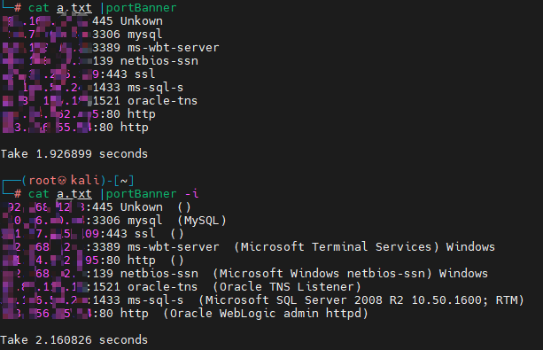
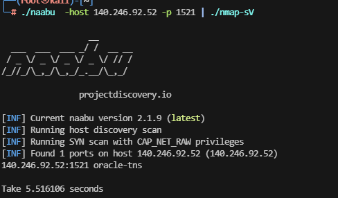

# REF
- https://github.com/boy-hack/nmap-parser  
- https://github.com/lcvvvv/gonmap
- https://github.com/nmap/nmap

# nmap-sV
使用nmap指纹，利用go实现指纹探测
**[仅 tcp  !!!!!]**
```
No input detected. Hint: cat ip:port.txt | file
Usage of nmap-sV:
  -b    Show port banner
  -i    Show all info
  -o string
        Output to  json 
  -thread int
        Threads (default 100)
  -time int
        timeout for port (default 5)

```

  
从naabu获取输入
