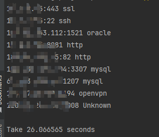

# REF
- https://github.com/boy-hack/nmap-parser  
- https://github.com/lcvvvv/gonmap
- https://github.com/nmap/nmap
- https://github.com/projectdiscovery/naabu

# nmap-sV
使用nmap指纹，利用go实现指纹探测
>- new.json为新增加的探针与对应的规则
>- 已有探针上添加匹配规则，使用AddPattern函数
>- 支持域名，未添加端口则默认为80
>- UDP只会探测处于优先端口列表中的端口，如果未匹配并且Body为空则会更改为关闭状态
>- 待完善：ud端口的判断
```
No input detected. Hint: cat ip:port.txt | file
Usage of nmap-sV:
Options:
  -b    Show port banner
  -i    Show all info
  -n int
        the number of tasks each goruntine will handle when send and match (default 30)
  -o string
        Output to  json
  -t int
        Threads (default 50)
  -time int
        timeout for port (default 5)

```
优化：利用goruntine加快了探针发送与匹配速度  
  
从管道符获取输入，如naabu   
  
其他示例  
  
