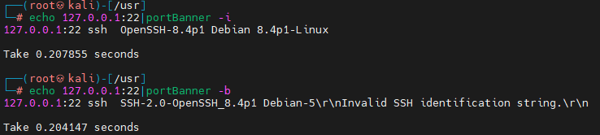

# portBanner

Port fingerprint recognition

```
No input detected. Hint: cat ip:port.txt | file
Usage of portBanner:
  -b    Show port banner
  -i    Show all info
  -o string
        Output to  json file
  -s string
        Send data,Example: rdp,http (default "All")
  -t int
        Threads (default 100)
```
**nmap.jspn , all \x0 need replaced by \x00 !!!! **


